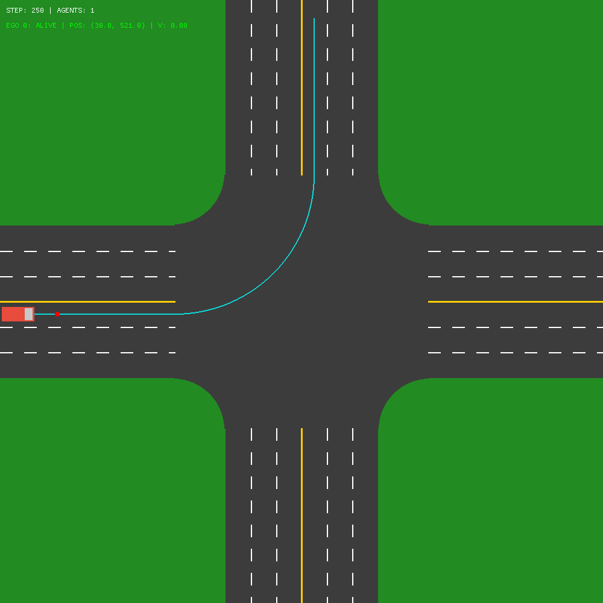
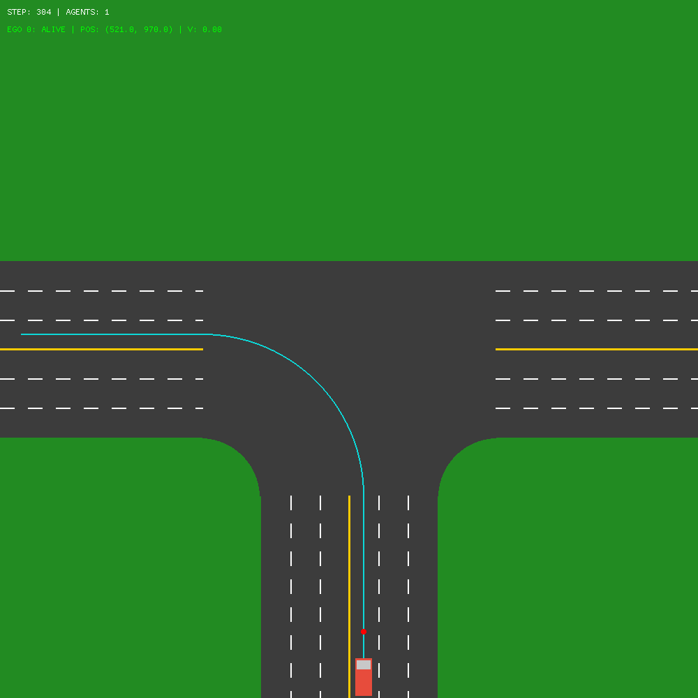
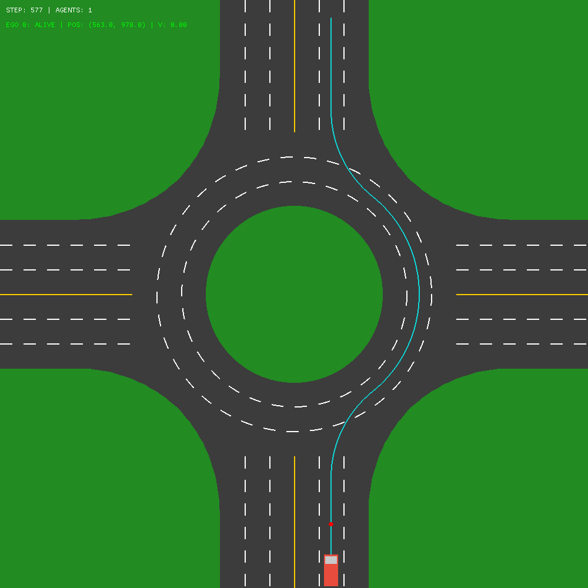
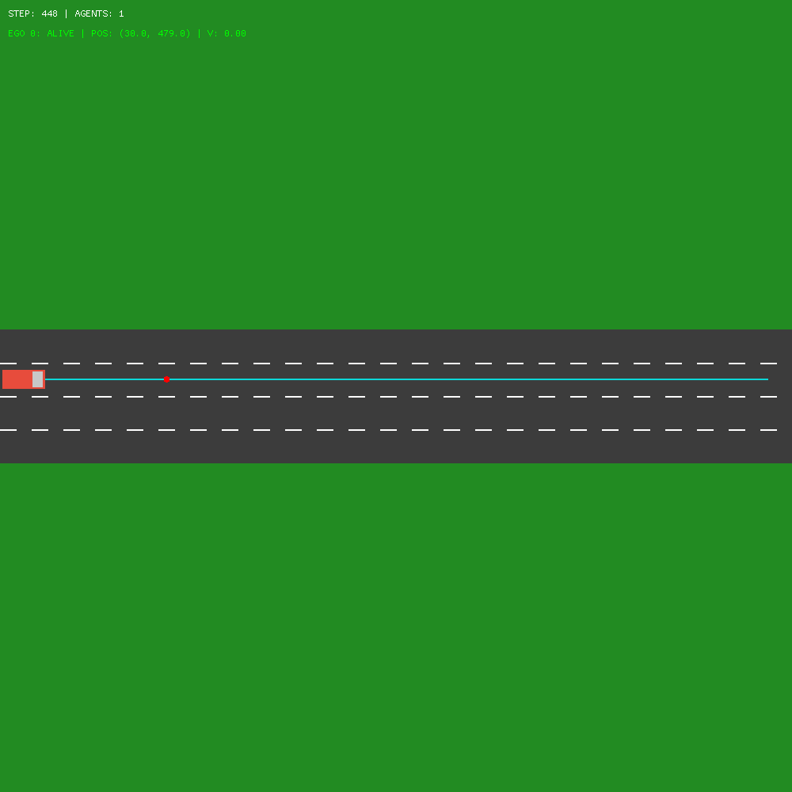
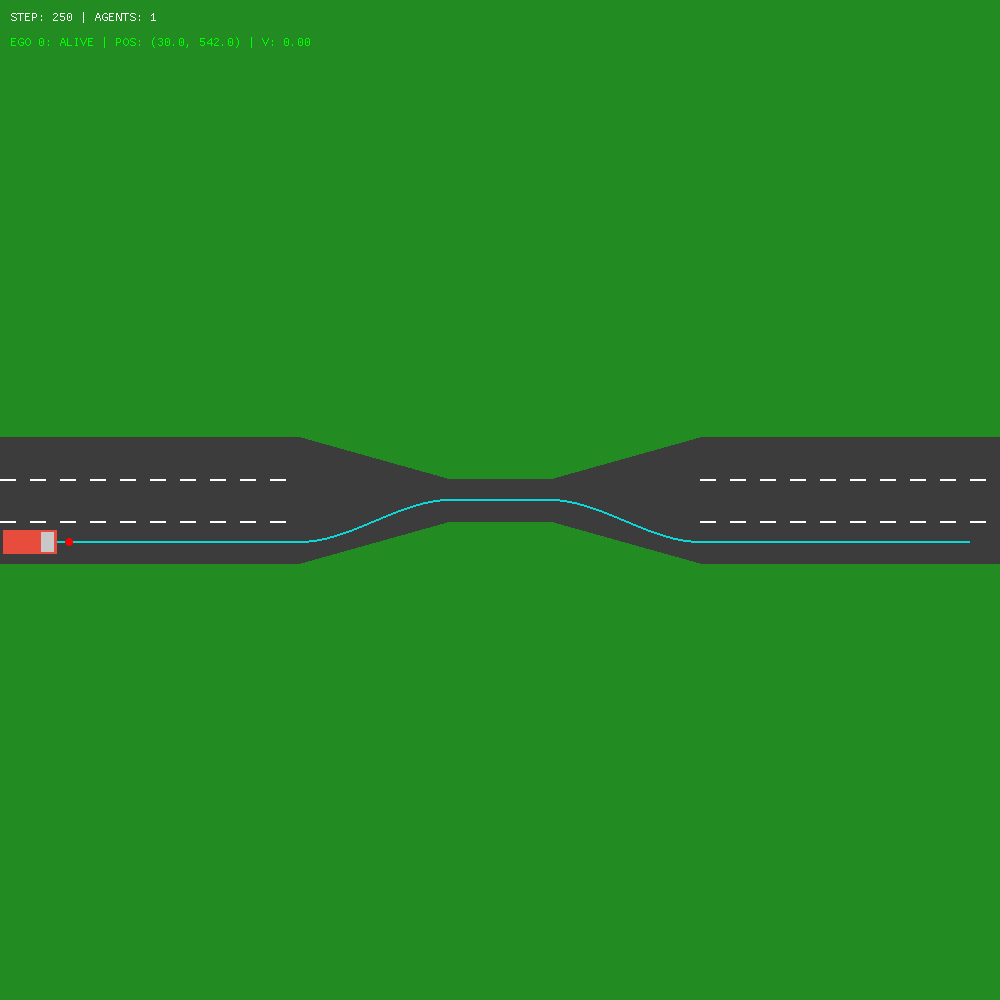

# MARL 无信号路口环境 🚦

这是一个基于 **C++ (pybind11) + OpenGL/GLFW** 的轻量级多智能体强化学习 (MARL) 无信号路口仿真环境。

项目实现了基于 **运动学自行车模型** 的车辆控制、**贝塞尔曲线** 导航、**线束激光雷达** 感知以及符合工业标准的 **语义化 RL 观测空间**。

---

## 📊 观测空间 (Observation Space)

环境提供 **145 维** 的连续向量作为观测输入：

- **0-3: Ego 状态**：`[x, y, v, heading]` (归一化)
- **4-5: 导航目标**：`[距离目标点, 航向偏差]`
- **6-13: 路面与拓扑特征 (重点)**：
    - `road_edge_dist_L/R`: 左右路边缘距离采样
    - `off_road_flag`: 离路标志
    - `on_line_flag`: 压黄线标志
    - **`signed_cte`**: 相对路径中心线的带符号横向偏差 (左正右负)
    - **`path_heading_err`**: 相对路径切线的局部航向偏差
    - **`in_lane` & `lane_id`**: 车道存在性及 ID 索引
- **14-48: 邻居车辆 (最近 5 个)**：每个邻居 7 维：
    - `[dx, dy, dv, dtheta, intent]` + **`[rel_long, rel_lat]`** (Ego 坐标系下的纵向/横向相对位置)
- **49-144: LiDAR 感知**：96 线激光雷达距离数据

---

## 📸 场景展示

<table>
  <tr>
    <td align="center" width="50%">
      
      <br />Intersection
    </td>
    <td align="center" width="50%">
      
      <br />T
    </td>
  </tr>
  <tr>
    <td align="center" width="50%">
      
      <br />Roundabout
    </td>
    <td align="center" width="50%">
      
      <br />Highway
    </td>
  </tr>
  <tr>
    <td align="center" width="50%">
      
      <br />Onramp Merge
    </td>
    <td align="center" width="50%">
      
      <br />Lane Bottleneck
    </td>
  </tr>
</table>

---

## 📂 文件结构

### 核心文件
- `core/env.py`：Python 侧环境封装（对外 API：`ScenarioEnv`），负责参数配置、调用 C++ 后端、组织 obs/reward/info
- `core/cpp_backend.py`：Python ↔ C++ 后端桥接
- `core/cpp/`：C++ 后端源码（pybind11 扩展模块），包含仿真、渲染（OpenGL/GLFW）与传感器/交通流逻辑
- `core/utils.py`：路线映射、lane layout 等辅助
- `scenarios/`：场景资源目录。每个场景文件夹（如 `cross_2lane/`）包含：
  - `drivable.png`：可行驶区域掩码
  - `yellowline.png`：黄线/实线掩码（用于压线碰撞/惩罚）
  - `lane_dashes.png`：虚线渲染图
  - `lane_id.png`：车道 ID 图（用于车道索引/调试）

### 测试文件
- `test.py`：键盘控制测试脚本（会调用 C++ 渲染窗口）

---

## 🚀 快速开始

### 安装

#### 构建依赖

- `CMake >= 3.18`
- 支持 `C++17` 的编译器（Linux: GCC/Clang；Windows: MSVC）
- `OpenGL`
- `GLFW`（Linux 下 CMake 会 `find_package(glfw3 3.3 REQUIRED)`）
- `PyTorch`（用于提供 C++ 侧 `LibTorch`，CMake 会通过 Python 自动定位 Torch 的 CMake 配置）

#### 1. 编译 C++ 后端

```bash
cd core/cpp
mkdir -p build && cd build
cmake -DCMAKE_BUILD_TYPE=Release ..
# Linux
make -j$(nproc)
# Windows (MSVC)
cmake --build . --config Release
```

#### 2. pip 安装本环境 (推荐开发模式)

在项目根目录执行：

```bash
pip install -e .
```

也可以仅安装 Python 依赖：

```bash
pip install -r requirements.txt
```

#### 3. 运行测试

```bash
python test.py
```

---

## 🎮 交互/快捷键

在渲染窗口中可使用键盘快捷键进行交互：

- **V**：切换渲染模式（2D 顶视 / 3D 跟随 / 3D 轨道视角切换）。
- **C**：开启/关闭 **Connections** 连线可视化（显示智能体间的感知关联，为深红色连线）。
- **TAB**：在存活的 Ego 智能体之间**切换视角**（多智能体模式专用）。
- **L**：在 `test.py` 等脚本中通常绑定为开关 LiDAR 可视化。
---

## 🎮 使用方法

安装完成后，你可以在任何地方通过 `drivesimx` 导入并使用环境：

```python
from drivesimx import ScenarioEnv
import numpy as np

# 1. 准备配置
config = {
    'scenario_name': 'cross_2lane',  # 必填：匹配 scenarios/ 下的目录名
    'traffic_flow': True,            # True=单智能体+交通流, False=多智能体
    'traffic_density': 0.5,          # 交通密度
    'traffic_mode': 'stochastic'     # 交通流模式 stochastic为随机模式，constant为固定模式
    'render_mode': 'human',          # 'human' 或 None
    'show_lidar': False,
    'show_lane_ids': False,
    'max_steps': 2000,
}

# 2. 创建环境
env = ScenarioEnv(config)

# 3. 运行循环
obs, info = env.reset()
for _ in range(1000):
    action = np.array([0.5, 0.0])
    obs, reward, terminated, truncated, info = env.step(action)
    env.render()
    if terminated or truncated:
        obs, info = env.reset()
```

---

## ⚙️ 环境配置

### 单智能体模式（带交通流）

```python
config = {
    'scenario_name': 'cross_2lane',
    'traffic_flow': True,  # 启用交通流
    'traffic_density': 0.5,  # 交通密度
    'traffic_mode': 'stochastic', # 交通流模式 
    'render_mode': 'human',
    'max_steps': 2000,
}
```

### 多智能体模式（无交通流）

```python
config = {
    'scenario_name': 'cross_2lane',
    'traffic_flow': False,  # 禁用交通流
    'num_agents': 4,  # 智能体数量（>1 时默认启用 team reward，无需显式设置）
    # 'use_team_reward': True,  # 可选：显式覆盖（默认当 num_agents>1 时为 True）
    'render_mode': 'human',
    'max_steps': 2000,
}
```

---

## 🎯 奖励函数配置

奖励函数已集成在 `core/env.py` 中，可以通过 `reward_config` 参数自定义：

```python
from core.env import DEFAULT_REWARD_CONFIG

# 1. 使用默认配置
config = {
    'reward_config': DEFAULT_REWARD_CONFIG['reward_config']
}

# 2. 自定义奖励配置
custom_reward_config = {
    'progress_scale': 10.0,             # 进度奖励系数
    'stuck_speed_threshold': 1.0,        # 卡住速度阈值 (m/s)
    'stuck_penalty': -0.01,              # 卡住惩罚
    'crash_vehicle_penalty': -10.0,      # 车辆碰撞惩罚
    'crash_wall_penalty': -5.0,         # 撞墙/冲出道路惩罚
    'crash_line_penalty': -2.0,         # 压实线/黄线惩罚
    'success_reward': 10.0,             # 成功到达奖励
    'action_smoothness_scale': -0.02,    # 动作平滑度系数
    'team_alpha': 0.2,                  # 团队奖励混合系数（仅多智能体）
}

config = {
    'reward_config': custom_reward_config
}
```

### 奖励组成

**个体奖励** (Individual Reward):
```
r_i^ind(t) = r_prog(t) + r_stuck(t) + r_crashV(t) + 
             r_crashW(t) + r_crashL(t) + r_succ(t) + r_smooth(t)
```

**团队奖励** (Team Reward, 仅多智能体模式):
```
r_i^mix(t) = (1 - α) * r_i^ind(t) + α * r̄^ind(t)
```

其中：
- `r_prog`: 基于距离减少的进度奖励（归一化后乘以 `progress_scale`）
- `r_stuck`: 速度过低时的卡住惩罚（每步）
- `r_crashV`: 车辆碰撞惩罚（一次性）
- `r_crashW`: 撞墙/离开道路惩罚（一次性，通过 `CRASH_WALL` 触发）
- `r_crashL`: 压黄线/实线惩罚（一次性，通过 `CRASH_LINE` 触发）
- `r_succ`: 成功到达目标点的奖励（一次性）
- `r_smooth`: 动作平滑度奖励（基于加速度/转向变化，每步）

---

## 🚗 交通流设置 (Traffic Flow)

环境支持两种交通流模式，通过 `traffic_mode` 参数配置：

### 1. 随机模式 (`stochastic`) - 默认
- **行为**：基于 `traffic_density` (到达率) 随机生成 NPC。NPC 到达目的地或发生碰撞后会被移除（`erase`）。
- **适用场景**：常规强化学习训练，追求高随机性和真实交通分布。

### 2. 恒定模式 (`constant`)
- **行为**：根据 `traffic_density` 和 `traffic_kmax` 确定固定数量的 NPC 槽位（$K = \text{round}(\text{density} \times \text{kmax})$）。
- **关键特性**：
    - **长度恒定**：NPC 死亡后不会被移除，而是标记为 `alive=false` 并传送到屏外，保证 `traffic_cars` 数组长度不变。
    - **可冻结性**：支持 `env.freeze_traffic(True)`，冻结后死亡槽位不再补齐，确保搜索过程的确定性。
- **适用场景**：MCTS 规划、确定性状态回滚（Snapshot）、追求稳定交通压力的训练。

### 配置示例

```python
config = {
    'traffic_flow': True,
    'traffic_mode': 'constant',  
    'traffic_density': 0.5,      
    'traffic_kmax': 20,          
```

### NPC 车辆行为

NPC 车辆通过 C++ 后端驱动：
- **横向控制**：基于路径的 Pure Pursuit 增强型航向跟踪。
- **纵向控制**：具备自动避障的巡航控制。
- **生命周期**：
    - `stochastic`：移除并释放内存。
    - `constant`：重置状态并等待补齐（Refill）。

---

## 📝 TODO

- [x] 集成奖励计算到环境
- [x] 集成交通流生成到环境
- [x] 支持单智能体和多智能体模式
- [x] 支持多地图测试

---

## 📄 许可证

本项目遵循 MIT License。
